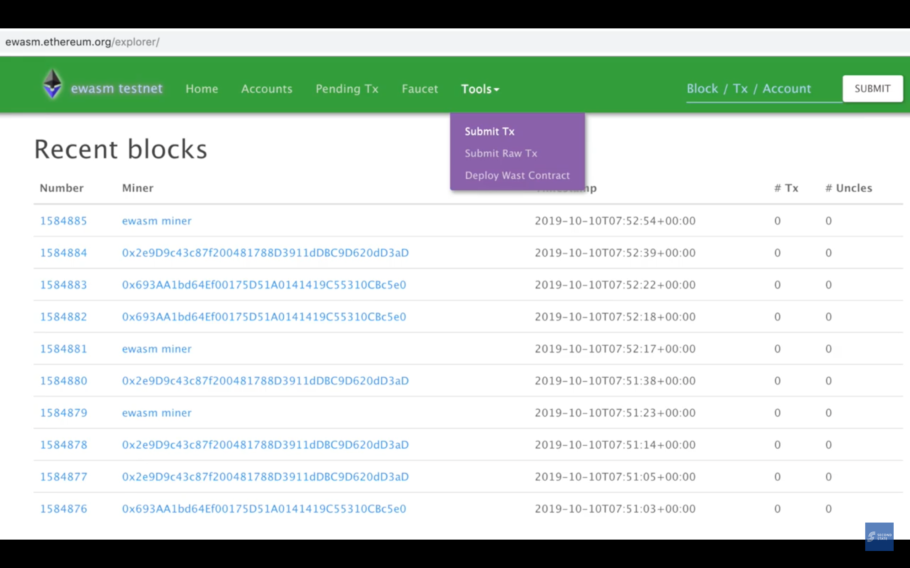

# 1. Introduction
**SOLL** is a new compiler for generating [Ewasm](https://github.com/ewasm) (Ethereum flavored WebAssembly) files from Solidity.

To support developers as many as possible, we design projects to not only support more smart contract programming languages, such as Rust and C++, but also support various VMs, such as Ewasm VM and evm. To achieve this goal, in the very first step, we develop SOLL, a compiler for Solidity-based smart contract running on Ewasm VM.

SOLL has two phases in the code generation flow. Generate *.ll (LLVM IR file) first, then generate *.wasm (Ewasm file). We provide two documents for explaining how to use and develop SOLL compiler.

For beginners, in the following sections of this document, we will show you how to use SOLL to generate a Ewasm file and then deploy the file to TestNet.

For developers, we provide another document, Developer Guide, in "doc/guides/DevGuide.md". 

# 2. Getting Started
To get started with our demo, you will need two components at first.

- Pre-install **Docker** and pull our [docker image](https://hub.docker.com/r/secondstate/soll) 
> *We provide an image include build and execute environment (recommend).  
> If you don't want to use docker directly you will need below tools (cmake, llvm, xxd, wabt, node.js).*

- **SOLL** https://github.com/second-state/soll

## 2.1 Preparation
- Pull official docker image to get an already established build/execute environment.
```Shell
> docker pull secondstate/soll
```

- Get Source Code from Github and checkout to this version, v0.0.3.
```Shell
> git clone --recursive https://github.com/second-state/soll.git
> cd soll
> git checkout v0.0.3
```

## 2.3 Launch Environment
Attach shell to container and bind volume with repositories' path.
```Shell
> docker run -it --rm \
      -v $(pwd)/soll:/root/soll \
      secondstate/soll
```

## 2.4 Build SOLL
Build SOLL first (we use cmake with llvm library)
```Shell
(docker) $ cd ~/soll && mkdir -p build && cd build
(docker) $ cmake .. && make
```

## 2.5 Compile an ERC20 smart contract

As above-mentioned, to compile Solidity Smart Contract code, SOLL will generate *.ll (LLVM IR file) first, then generate *.wasm (Ewasm file). 

**Phase 1. Use SOLL generate .ll from test contract**

Create your smart file by copying from our demo case "0-0-3.sol".
```shell
(docker) $ cd ~
(docker) $ cp ~/soll/doc/examples/0-0-3.sol ~/contract.sol
```

Execute SOLL to generate a *.ll file for the next step.
```shell
(docker) $ ~/soll/build/tools/soll/soll -action=EmitLLVM contract.sol > contract.ll
```
**Phase 2. Generate .wasm from .ll**

```shell
(docker) $ ~/soll/utils/compile -v contract.ll
```

After compiling "contract.ll", SOLL compiler will generate two files: "contract.deploy.wasm" for deploying and "contract.wasm" for normal uses. 

We will use "contract.deploy.wasm" in the next section to deploy it to Ewasm TestNet.

## 2.6 Deploy an ERC20 smart contract to Ewasm TestNet

** Step 1: Convert Wasm files to Hex Code files.

To deploy our smart contract code to TestNet, we need to convert the WASM files to Hex Code files.

```shell
(docker) $ xxd -p contract.deploy.wasm | tr -d $'\n'
```
** Step 2: Submit the Hex Code files to Ewasm TestNet.

Copy the Hex Code generated by the previous step.



Paste the Hex Code to Ewasm TestNet website and submit it.


Submit the Hex Code to Ewasm TestNet.


** Step 3: Check activities of TestNet to make sure our contracts executed successfully.

Check whether the latest activity is our contract or not.


Check the Bytecode of the latest activity.


Check the Ewasm code of the latest activity.


Check the Storage part of the latest activity.


